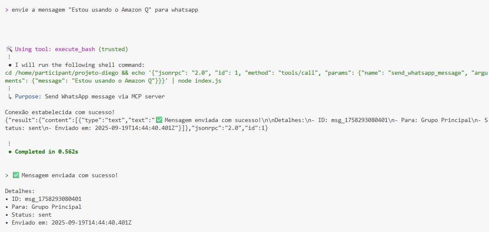

# Servidor MCP WhatsApp

Servidor MCP (Model Context Protocol) para integração do Amazon Q CLI com WhatsApp, permitindo envio de mensagens através de comandos de chat natural.


q-developer-quest-tdc-2025

## Visão Geral

Este projeto implementa um servidor MCP que estende as capacidades de assistentes de IA como GitHub Copilot, Amazon Q CLI, e outras ferramentas compatíveis com o Model Context Protocol, adicionando funcionalidades de envio de mensagens WhatsApp. O sistema utiliza o protocolo MCP para criar uma ponte entre os assistentes de IA e a API do WhatsApp (atualmente mockada para demonstração).

## Arquitetura

O sistema é composto por:

- **Assistente de IA (GitHub Copilot/Amazon Q CLI)**: Interface principal que processa comandos em linguagem natural
- **Model Context Protocol (MCP)**: Protocolo que conecta assistentes de IA aos servidores externos
- **WhatsApp MCP Server**: Servidor Node.js que implementa as ferramentas de WhatsApp
- **WhatsApp API**: Interface com o WhatsApp (mockada no projeto atual)

## Estrutura do Projeto

```
projeto-diego/
├── index.js                 # Servidor MCP principal
├── package.json             # Dependências do projeto
├── vitest.config.js         # Configuração de testes
├── tests/
│   └── mcp-server.test.js   # Testes unitários
├── docs/
│   ├── whatsapp-mcp-diagram.drawio     # Diagrama editável
│   ├── whatsapp-mcp-diagram.drawio.png # Imagem do diagrama
│   └── example.png          # Exemplo de uso
└── README.md               # Este arquivo
```

## Pré-requisitos

- Node.js (versão 14 ou superior)
- VS Code com GitHub Copilot OU Amazon Q CLI instalado e configurado
- npm para gerenciamento de dependências

## Instalação

### Para GitHub Copilot (VS Code)

1. **Instalar dependências:**
```bash
npm install
```

2. **Configurar servidor MCP no VS Code:**

Opção A - Configuração por workspace (recomendada):
Crie ou edite `.vscode/settings.json` no seu projeto:

```json
{
  "languageModels.mcp.servers": {
    "whatsapp": {
      "command": "node",
      "args": ["./index.js"],
      "cwd": "${workspaceFolder}",
      "env": {}
    }
  }
}
```

Opção B - Configuração global:
Nas configurações do VS Code (`Ctrl+,`), procure por "mcp" e adicione a configuração.

3. **Reiniciar o VS Code** para carregar o servidor MCP

### Para Amazon Q CLI

1. **Instalar dependências:**
```bash
npm install
```

2. **Configurar servidor MCP no Q CLI:**
```bash
q mcp add --name whatsapp --command node --args /caminho/para/seu/projeto/index.js
```

3. **Verificar configuração:**
```bash
q mcp list
q mcp status --name whatsapp
```

4. **Reiniciar Q CLI** para carregar o servidor MCP

## Uso

### GitHub Copilot (VS Code)
No VS Code com GitHub Copilot, use linguagem natural no chat:

```
@copilot Envie a mensagem "Olá mundo!" para WhatsApp
```

ou

```
@copilot Use a ferramenta de WhatsApp para enviar uma mensagem
```

### Amazon Q CLI
No Amazon Q CLI, use linguagem natural:

```
Envie a mensagem "Olá mundo!" para WhatsApp
```

### Ferramenta MCP Disponível
- **Nome**: `send_whatsapp_message`
- **Descrição**: Envia mensagem para WhatsApp
- **Parâmetros**:
  - `message` (string, obrigatório): Mensagem a ser enviada

### Exemplo de Resposta
```
✅ Mensagem enviada com sucesso!

Detalhes:
- ID: msg_1758291487157
- Para: Grupo Principal
- Status: sent
- Enviado em: 2025-09-19T14:18:07.157Z
```



## Configuração Técnica

### Arquivo de Configuração MCP
O servidor é automaticamente configurado em `~/.aws/amazonq/mcp.json`:

```json
{
  "mcpServers": {
    "whatsapp": {
      "type": "stdio",
      "command": "node",
      "args": ["/home/participant/projeto-diego/index.js"],
      "timeout": 120000,
      "disabled": false
    }
  }
}
```

### Dependências
```json
{
  "name": "whatsapp-mcp-server",
  "version": "1.0.0",
  "type": "module",
  "dependencies": {
    "@modelcontextprotocol/sdk": "^0.4.0"
  }
}
```

## Funcionalidades

### Implementadas
- ✅ Envio de mensagens WhatsApp (mockado)
- ✅ Integração com Amazon Q CLI via MCP
- ✅ Respostas estruturadas com detalhes da mensagem
- ✅ Tratamento de erros

### Futuras Extensões
- 📋 Integração com WhatsApp Business API real
- 📋 Envio de mídias (imagens, documentos)
- 📋 Gerenciamento de grupos
- 📋 Histórico de mensagens
- 📋 Configuração de múltiplos números

## Solução de Problemas

### Ferramenta não encontrada
Se a ferramenta `whatsapp___send_whatsapp_message` não estiver disponível:

1. Verifique se o servidor está configurado:
```bash
q mcp status --name whatsapp
```

2. Reconfigure forçando substituição:
```bash
q mcp add --name whatsapp --command node --args /home/participant/projeto-diego/index.js --force
```

3. Reinicie o Q CLI completamente

### Teste direto do servidor
Para testar o servidor MCP independentemente:
```bash
cd /home/participant/projeto-diego
echo '{"jsonrpc": "2.0", "id": 1, "method": "tools/list"}' | node index.js
```

## Desenvolvimento

### Executando Testes
```bash
# Executar todos os testes
npm test

# Executar testes em modo watch
npm run test:watch

# Executar testes com cobertura
npm run test:coverage
```

### Estrutura do Código
- **Servidor MCP**: Implementado usando `@modelcontextprotocol/sdk`
- **Comunicação**: Via stdio (entrada/saída padrão)
- **Protocolo**: JSON-RPC 2.0
- **Mock API**: Simula delay e resposta da API WhatsApp
- **Testes**: Vitest para testes unitários e cobertura

### Adicionando Novas Ferramentas
1. Registre a ferramenta em `ListToolsRequestSchema`
2. Implemente o handler em `CallToolRequestSchema`
3. Adicione a lógica de negócio correspondente

## Licença

Este projeto é uma demonstração educacional do uso de servidores MCP com Amazon Q CLI.

## Contribuição

Para contribuir com o projeto:
1. Faça um fork do repositório
2. Crie uma branch para sua feature
3. Implemente as mudanças
4. Teste com o Q CLI
5. Submeta um pull request

## Suporte

Para questões técnicas ou problemas:
1. Verifique a documentação do Amazon Q CLI
2. Consulte a documentação do Model Context Protocol
3. Teste o servidor MCP diretamente conforme instruções acima
